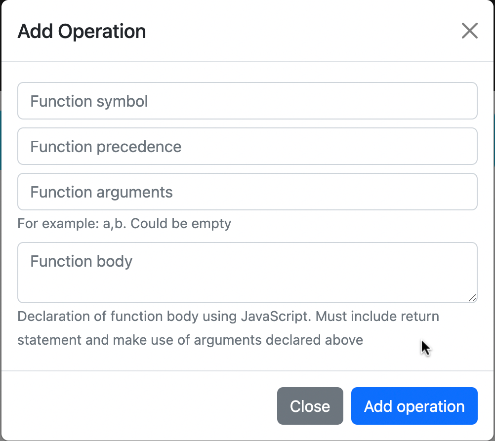

# Description

Simple implementation of calculator written on typescript using MVC pattern. Calculating occurs using Shunting Yard Algorithm.

# Usage

## Adding new operations

To add a new operation click the button "Add new operation"

Then type operation symbol, it's precedence, arguments (optionally) and the function body itself.



<sup>Bear in mind that function body is converted to JavaScript, consequently you can use all the JavaScript features you need
</sup>

# Technologies

- TypeScript
- Jest
- Webpack
- Bootstrap

# How to run

```
npm i
npm run dev
```

# Testing

To run the tests

```
npm test
```
