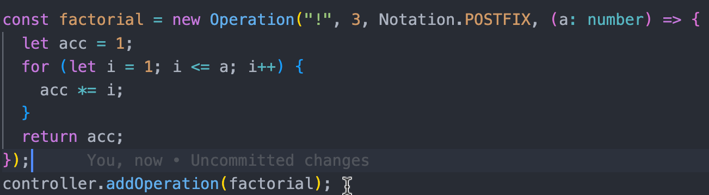

# Description

Simple implementation of calculator written on typescript using MVC pattern. Calculating occurs using Shunting Yard Algorithm.

# Usage

## Adding new operations

To add a new operation, define it via Operation class
and invoke addOperation() on controller.
Validity of operation being added resets fully on developer's shoulders


# Technologies

- TypeScript
- Jest
- Webpack
- Bootstrap

# How to run

```
npm i
npm run dev
```

# Testing

To run the tests

```
npm test
```
